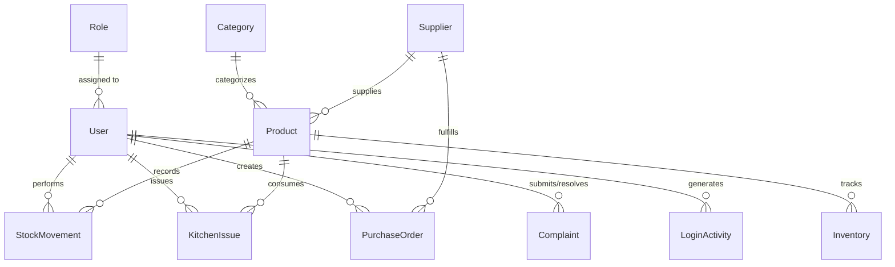
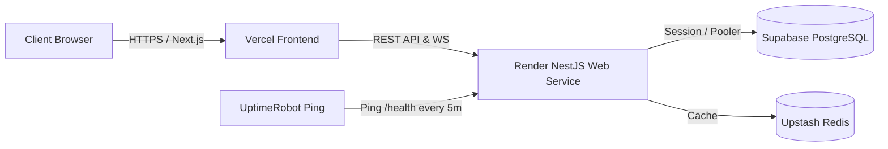

# JKKM Mess ERP — Comprehensive Software & Architecture Report

Enterprise-grade **Hostel Mess Automation & Inventory Management System** built for the **JKKM Group of Institutions**.

[](https://erp.arockiamedicalcentre.in)
[](https://jkkm-mess.vercel.app)
[](https://nextjs.org/)
[](https://nestjs.com/)
[](https://www.prisma.io/)
[-4169E1?style=for-the-badge&logo=postgresql)](https://neon.tech)
[](https://eslint.org/)

---

## 📋 Executive Summary

The **JKKM Mess ERP** is a full-stack, enterprise-level digital automation platform designed to digitize hostel dining operations, prevent raw ingredient wastage using First-Expiring, First-Out (FEFO) batch tracking, automate meal headcount forecasting through AI analytics, and manage multi-role staff operations across 7 institutional user profiles.

### Core System Capability Highlights:
*   **Real-time Stock Tracking**: Automatic low-stock triggers, unit cost calculation, and batch expiration alerts.
*   **FEFO Kitchen Issue Engine**: Enforces strict FIFO/FEFO stock dispatch algorithms to minimize perishable ingredient spoilage.
*   **Camera Barcode Scanning**: WebCam and mobile camera integration via ZXing library for instant product lookup and rapid stock issue entries.
*   **Meal Attendance & Biometric Scan Logging**: Tracks student dining headcounts by meal (Breakfast, Lunch, Snacks, Dinner) across active hostels.
*   **AI-Powered Demand Forecasting**: Predictive consumption algorithms that forecast 7-day ingredient requirements based on student occupancy trends.
*   **Student Complaints Workflow**: Integrated ticket submission, hostel warden resolution routing, and status tracking.
*   **Real-time Socket.io Alerts**: System-wide WebSockets gateway for instant warning notifications and low-stock email triggers.

---

## 🏗️ Repository Architecture & Directory Structure

The project is architected as a clean monorepo:

```
d:\Github\erp\
├── backend/                  # NestJS 10 Microservice REST API & WebSocket Gateway
│   ├── prisma/               # Schema definitions, migrations, and seed scripts
│   │   ├── schema.prisma     # Data models & relational schema
│   │   └── seed.ts           # Demo database seeding script
│   ├── src/                  # NestJS TypeScript Modules
│   │   ├── ai/               # AI consumption & demand forecasting service
│   │   ├── attendance/       # Student meal headcount & scan tracking
│   │   ├── auth/             # Passport JWT authentication & lockout security
│   │   ├── complaints/       # Student grievance ticket lifecycle
│   │   ├── gateway/          # Socket.io WebSockets gateway module
│   │   ├── inventory/        # Stock management & valuation services
│   │   ├── kitchen/          # FEFO kitchen stock issue engine
│   │   ├── menu/             # Weekly meal schedule planner
│   │   ├── notifications/    # Alert dispatching & mail triggers
│   │   ├── products/         # Catalog & barcode lookup service
│   │   ├── purchases/        # Purchase orders & approval workflows
│   │   ├── reports/          # Financial Excel/CSV report exports
│   │   ├── suppliers/        # Vendor directory & lead time analytics
│   │   └── users/            # User account management & role guard
│   └── tools/                # DNS bypass script utilities (db-push.js, db-seed.js)
├── frontend/                 # Next.js 16 (App Router) Single-Page Web Application
│   ├── app/                  # App Router Page Views & Layouts
│   │   ├── dashboard/        # Role-based dashboard sub-modules (15 modules)
│   │   ├── login/            # Glassmorphic auth portal with role presets
│   │   ├── globals.css       # Design tokens, Tailwind CSS v4 & HSL themes
│   │   └── layout.tsx        # In-flow flex-sibling DOM layout container
│   ├── components/           # Reusable UI components (Sidebar, Topbar, StatsCards)
│   ├── lib/                  # Axios HTTP client, Socket.io client, utility helpers
│   └── store/                # Zustand global state stores (authStore, uiStore, notificationStore)
├── nginx/                    # Reverse proxy configuration for SSL/TLS termination
├── scripts/                  # Automated deployment and container startup scripts
├── docker-compose.yml        # Development environment multi-container orchestra
└── docker-compose.prod.yml   # Production environment container configuration
```

---

## 🛠️ Technology Stack & Framework References

### 1. Frontend Technologies
*   **Core Framework**: Next.js 16.2.6 (Turbopack Engine) with React 19.
*   **Styling & Design System**: Tailwind CSS v4, custom HSL CSS variables, glassmorphism UI cards, Google Fonts (**Inter** typography).
*   **State Management**: Zustand 5.0 for persistent auth session tokens, UI sidebar states, and global notification feeds.
*   **Data Visualization**: Recharts 2.15 for interactive expense area charts, meal attendance bar graphs, and waste pie charts.
*   **Icons**: Lucide React for consistent vector iconography.
*   **Barcode Hardware Scanning**: `@zxing/browser` & `@zxing/library` for real-time camera video stream decoding.
*   **Theme Engine**: `next-themes` enabling zero-FOUC dual Light/Dark mode.

### 2. Backend Technologies
*   **Core Framework**: NestJS 10.0.0 (TypeScript-first modular backend).
*   **ORM Layer**: Prisma ORM v5.22 with `@prisma/client`.
*   **Database Engines**: Serverless PostgreSQL hosted on Neon Cloud (Production) & PostgreSQL 16 (Local Docker).
*   **Caching & In-Memory Storage**: Upstash Serverless Redis.
*   **Authentication & Security**: Passport.js with JWT strategy, Helmet HTTP security headers, and BCrypt password hashing.
*   **Real-time Communication**: `@nestjs/websockets` and Socket.io v4.
*   **Email Alerting**: Nodemailer connected to Google SMTP service for automated email alerts.

---

## 🗄️ Relational Database Schema & Data Models

The Prisma data model ([backend/prisma/schema.prisma](file:///d:/Github/erp/backend/prisma/schema.prisma)) models institutional hostel operations:



### Key Relational Entities:
1.  **`User` & `Role`**: Multi-tenant role system (`SUPER_ADMIN`, `MESS_MANAGER`, `STOREKEEPER`, `KITCHEN_STAFF`, `ACCOUNTANT`, `HOSTEL_WARDEN`, `STUDENT_VIEWER`).
2.  **`Product` & `Category`**: Packaged food items, fresh vegetables, spices, and bulk grains with barcode mappings and reorder thresholds (`minStockLevel`).
3.  **`Inventory`**: Active batch quantities, purchase prices, batch numbers, storage location tags, and expiration dates (`expiryDate`).
4.  **`KitchenIssue`**: Daily meal cooking issue logs, FEFO batch matching records, and meal categories (Breakfast, Lunch, Dinner, Snack).
5.  **`PurchaseOrder`**: Vendor PO generation, total valuation, and approval state machines.
6.  **`Attendance` & `BiometricScan`**: Meal headcount records per date and hostel location.
7.  **`Complaint`**: Student ticket lifecycle (`PENDING` -> `RESOLVED`) with resolution timestamps and warden notes.
8.  **`LoginActivity`**: Security audit log tracking IP addresses, device user-agents, and login attempt outcomes (`SUCCESS` / `FAILED`).

---

## 🔐 Role-Based Access Control (RBAC) Matrix

The system implements strict dual-layer authorization (Next.js route guards on the frontend + NestJS `RolesGuard` decorators on API routes):

| Feature / Sub-Module | Super Admin | Mess Manager | Storekeeper | Kitchen Staff | Accountant | Hostel Warden | Student Viewer |
| :--- | :---: | :---: | :---: | :---: | :---: | :---: | :---: |
| **System Overview Dashboard** | ✅ | ✅ | ✅ | ✅ | ✅ | ✅ | ✅ |
| **Daily Menu Planner** | ✅ | ✅ | ✅ | ✅ | ✅ | ✅ | ✅ |
| **Inventory Tracking** | ✅ | ✅ | ✅ | ❌ | ❌ | ❌ | ❌ |
| **Product Catalog** | ✅ | ✅ | ✅ | ❌ | ❌ | ❌ | ❌ |
| **Purchase Orders** | ✅ | ✅ | ✅ | ❌ | ✅ | ❌ | ❌ |
| **Supplier Directory** | ✅ | ✅ | ✅ | ❌ | ❌ | ❌ | ❌ |
| **Kitchen Stock Issues (FEFO)**| ✅ | ✅ | ❌ | ✅ | ❌ | ❌ | ❌ |
| **Camera Barcode Scanner** | ✅ | ✅ | ✅ | ✅ | ❌ | ❌ | ❌ |
| **Student Complaints** | ✅ | ❌ | ❌ | ❌ | ❌ | ✅ | ✅ |
| **Financial & Cost Reports** | ✅ | ✅ | ❌ | ❌ | ✅ | ❌ | ❌ |
| **Meal Attendance Tracking** | ✅ | ❌ | ❌ | ❌ | ❌ | ✅ | ❌ |
| **AI Demand Forecasting** | ✅ | ✅ | ❌ | ❌ | ❌ | ❌ | ❌ |
| **User Account Management** | ✅ | ❌ | ❌ | ❌ | ❌ | ❌ | ❌ |
| **Security Audit Logs** | ✅ | ❌ | ❌ | ❌ | ❌ | ❌ | ❌ |

---

## 🎨 UI/UX Design System & Layout Architecture

### Flex-Sibling Layout Flow (Preventing Content Overlap)
The application utilizes an **in-flow flex-sibling DOM architecture** ([Sidebar.tsx](file:///d:/Github/erp/frontend/components/layout/Sidebar.tsx) & [layout.tsx](file:///d:/Github/erp/frontend/app/dashboard/layout.tsx)):

*   **Desktop Mode (`md:flex`)**: The sidebar is rendered as an in-flow flex container child (`w-64` expanded / `w-16` collapsed). The main content container (`flex-1 flex flex-col min-w-0`) occupies the exact remaining viewport width beside the sidebar. This eliminates layout calculation bugs and guarantees **zero overlap** between topbars, headers, and navigation menus.
*   **Mobile Mode (`md:hidden`)**: On small screens, the sidebar transitions to an overlay drawer modal (`fixed inset-0 z-50`) featuring a backdrop blur and dismiss controls.

### Visual Styling Highlights
*   **Dual View Modes**: Switch between **Table View** and responsive **Grid Card View** on pages like User Management (`/dashboard/users`).
*   **Staff Initials Avatars**: Dynamic gradient initials avatars for staff profiles.
*   **Role Color-Coding**: Soft badges paired with Lucide vector icons (Purple for Admin, Blue for Manager, Indigo for Warden, Cyan for Storekeeper, Amber for Kitchen Staff, Slate for Student).
*   **Glowing Pulsing Indicators**: Live status dots (`bg-emerald-400 animate-pulse`) for active connections and stock health status.

---

## 🧪 Testing, Quality Assurance & Build Verification

The codebase has undergone full diagnostic sweeps:

| Verification Suite | Execution Command | Result Status | Notes / Coverage |
| :--- | :--- | :--- | :--- |
| **Backend TypeScript Check** | `cd backend; npx tsc --noEmit` | `PASS` | 0 type errors |
| **Backend Unit Tests** | `cd backend; npm run test` | `PASS` | 14/14 tests passed (Auth lockout & FEFO logic) |
| **Backend Linting** | `cd backend; npm run lint` | `PASS` | Clean execution |
| **Frontend TypeScript Check** | `cd frontend; npx tsc --noEmit` | `PASS` | 0 type errors |
| **Frontend ESLint Audit** | `cd frontend; npm run lint` | `PASS` | **0 Errors, 0 Warnings** |
| **Frontend Production Build** | `cd frontend; npm run build` | `PASS` | All 21 App Router static pages compiled cleanly |

---

## 🚀 Local Development Setup

### Method A: Running with Docker Compose (Recommended)
Spins up PostgreSQL, Redis, NestJS Backend, and Next.js Frontend simultaneously:

1.  Clone repository and navigate to root:
    ```bash
    cd erp
    ```
2.  Launch services:
    ```bash
    docker compose up -d --build
    ```
3.  Access URLs:
    *   **Frontend**: `http://localhost:3000`
    *   **Backend REST API**: `http://localhost:3001/api/v1`
    *   **Swagger API Docs**: `http://localhost:3001/api/docs`

---

### Method B: Manual Service Execution

#### 1. Backend Service:
```bash
cd backend
npm install
# Configure .env file with DATABASE_URL, PORT=3001, JWT_SECRET
npx prisma generate
npx prisma migrate dev
npm run db:seed
npm run start:dev
```

#### 2. Frontend Service:
```bash
cd frontend
npm install
# Configure .env.local with NEXT_PUBLIC_API_URL=http://localhost:3001/api/v1
npm run dev
```

---

## 🔑 Demo Access Credentials

Seeded testing accounts for role verification:

| Role Profile | Seeded Email | Password | Access Rights |
| :--- | :--- | :--- | :--- |
| **Super Admin** | `admin@jkkm.edu.in` | `Jkkm@Admin2026` | Full system access, registration, audit logs |
| **Mess Manager** | `messmanager@jkkm.edu.in` | `Jkkm@Mess2026` | Inventory, purchases, supplier management, AI forecasting |
| **Storekeeper** | `storekeeper@jkkm.edu.in` | `Jkkm@Store2026` | Barcode entry, stock movements, PO requests |
| **Kitchen Staff** | `kitchen@jkkm.edu.in` | `Jkkm@Kitchen2026` | FEFO stock issues, cooking logs |
| **Accountant** | `accounts@jkkm.edu.in` | `Jkkm@Accounts2026` | Financial report downloading, expense valuation |
| **Hostel Warden** | `warden@jkkm.edu.in` | `Jkkm@Warden2026` | Headcount attendance, student complaint resolution |
| **Student Viewer** | `student@jkkm.edu.in` | `Jkkm@Student2026` | View weekly menu, file complaint tickets |

---

## 🌐 Live Production Deployment Architecture



1.  **Frontend**: Deployed to **Vercel** (`https://jkkm-mess.vercel.app` & custom domain `https://erp.arockiamedicalcentre.in`).
2.  **Backend**: Containerized Docker web service deployed to **Render**.
3.  **Database**: Managed PostgreSQL hosted on **Supabase** / **Neon Cloud**.
4.  **Cache**: Serverless Redis hosted on **Upstash**.
5.  **24/7 Keep-Alive**: UptimeRobot HTTP monitor pinging `https://your-render-url/api/v1/health` every 5 minutes to prevent Render free-tier container sleep.

---

## ⚠️ Institutional Network DNS Resolutions & Bypass Tools

If institutional or college proxies block remote cloud database endpoints (`*.neon.tech`, `supabase.com:5432`), use the included DNS bypass scripts located in `/backend/tools`:

*   **Database Push Utility**:
    ```bash
    node backend/tools/db-push.js
    ```
*   **Database Seeding Utility**:
    ```bash
    node backend/tools/db-seed.js
    ```
These scripts perform custom Google Public DNS (`8.8.8.8`) lookups to bypass local network DNS hijacking.
