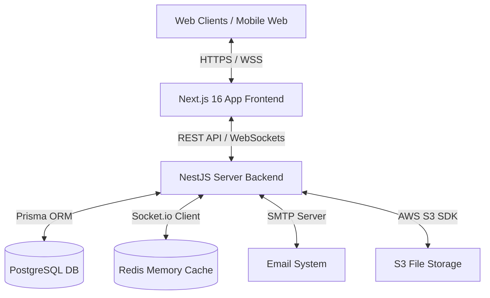

# JKKM Mess ERP — Complete System Analysis & Architectural Report

This document presents a comprehensive, senior-architect-level analysis of the **JKKM Enterprise Hostel Mess Automation ERP** system. It details the system architecture, database design, API design patterns, frontend ecosystem, accessibility standards, real-time alert mechanics, and deployment guidelines.

---

## 📊 1. System Overview & Architecture

The JKKM Mess ERP is designed to automate inventory tracking, vendor management, purchasing workflows, daily kitchen issues, meal consumption tracking, and student attendance for college hostel mess halls.



### Core Stack
* **Frontend**: Next.js 16 (App Router) + Tailwind CSS v4 + TypeScript + Zustand (State Management) + Socket.io-client.
* **Backend**: NestJS 10 + TypeScript + Prisma ORM + Socket.io (WebSocket Gateway).
* **Database**: PostgreSQL (Structured ACID Transactions).
* **Cache**: Redis (WebSocket Gateway adapter & state management).
* **Storage**: Amazon S3 (Bill images, reports PDF/Excel storage).

---

## 🗄️ 2. Database Schema & Transactional Safety

The database layer is managed via **Prisma ORM** mapping to a PostgreSQL instance. The schema is normalized and supports transactional safety (ACID compliance) for all inventory operations.

### Core Data Models
* **User & Role**: Implements Role-Based Access Control (RBAC) with roles like `Super Admin`, `Mess Manager`, `Storekeeper`, `Accounts Department`, and `Kitchen Staff`.
* **Category & Product**: Tracks packaged, fresh vegetable, and bulk ingredients with units (`KG`, `LITRE`, `PIECE`, etc.) and safety threshold parameters (`minStockLevel`).
* **Supplier**: Vendor database containing address, banking coordinates (IFSC, Account), and tax registration details (GST, PAN).
* **Inventory & StockMovement**: Logs specific batch numbers, cost metrics, and manufacturing/expiry dates. Implements First-In-First-Out (FIFO) stock depletion.
* **Purchase & PurchaseItem**: Handles purchase orders with approval workflows. Upon approval, items are auto-credited to active inventory.
* **DailyIssue & ConsumptionLog**: Logs kitchen stock releases per meal session (`BREAKFAST`, `LUNCH`, `DINNER`, `SNACK`) along with headcount parameters to calculate per-student raw material consumption costs.
* **Wastage**: Reports details and cost metrics for damaged or expired stock.
* **Notification & AuditLog**: Tracks user actions and triggers automated alerts.

### Transactional Integrity (FIFO Stock Flow)
Inventory levels must remain consistent. For example, during a kitchen stock release:
1. The NestJS backend opens a transaction scope: `this.prisma.$transaction(async (tx) => { ... })`.
2. Available inventory batches for the product are queried, sorted by creation date (FIFO: `orderBy: { createdAt: 'asc' }`).
3. Stock is deducted from the oldest batch. If the batch runs out, the subtraction rolls over to the next batch.
4. If total active inventory is insufficient to satisfy the requested issue quantity, the transaction throws a `BadRequestException` and rolls back all database modifications, preventing partial stock corruption.

---

## 📡 3. Backend Service Architecture & APIs

The NestJS backend is highly modular. Each business boundary is encapsulated in its own module:

```
src/
├── auth/            # JWT Token creation, Passport Guards, and Public routing
├── users/           # Administrator user profile controls
├── products/        # Catalog management and scanner barcode mappings
├── inventory/       # Real-time stock counts, FIFO depletion, and alerts
├── suppliers/       # Vendor profile directory
├── purchases/       # Purchase requests and approval validation steps
├── kitchen/         # Kitchen issues module
├── consumption/     # Multi-dimensional consumption logs and metric calculations
├── wastage/         # Spill and expiry write-off logs
├── reports/         # Dynamic Excel and PDF data exports
├── attendance/      # Student headcount tracking
├── notifications/   # System-wide warning notification models
├── gateway/         # Real-time WebSockets event gateway
└── prisma/          # Global DB connection client
```

### Security & Role Authorization
All write API operations are guarded. The backend checks incoming requests using:
1. `JwtAuthGuard`: Validates the caller's JWT token.
2. `RolesGuard`: Parses controller metadata `@Roles(...)` and checks if the authenticated user has appropriate permissions (e.g., restricting purchase approvals to the `Super Admin`, `Mess Manager`, or `Accounts Department`).

---

## 🎨 4. Frontend Architecture & Design Aesthetics

The frontend is built on **Next.js 16 (App Router)** and styled using a premium, dark-mode glassmorphic interface.

### UI Styling Tokens
* **Colors**: Uses modern, custom HSL values (`--background: 224 40% 8%`, `--card: 224 40% 12%`, `--primary: 224 76% 58%`) to establish a clean, high-contrast visual design.
* **Glassmorphism**: Custom CSS utilities (`.glass-card`) combine backdrop blurs (`backdrop-filter: blur(16px)`) with thin borders (`border-white/12`) to simulate frosted glass.
* **Animations**: Transitions (like the collapsible sidebar) leverage GPU-accelerated translate values (`translate-x-0` / `-translate-x-full`) to maintain a steady **60fps** refresh rate.

### State Management (Zustand)
Global states are divided into modular Zustand stores:
* `useAuthStore`: Controls JWT session states, user profiles, and login flows.
* `useUIStore`: Manages sidebar collapse, mobile drawer states, and user theme toggles.
* `useNotificationStore`: Collects system alerts in real-time.

---

## ♿ 5. Accessibility (a11y) & Spacing Systems

The application has been audited and updated to achieve high WCAG accessibility and design standards:

* **Global Focus Rings**: Standardized outline highlights inside [globals.css](file:///d:/Github/New%20folder/frontend/app/globals.css) using `:focus-visible`. Whenever keyboard tabbing occurs, the active control receives a clear highlight ring (`outline: 2px solid hsl(var(--primary))`) with a `2px` offset.
* **Semantic Landmarks**: Major page templates use semantic HTML5 elements (`<aside>`, `<header>`, `<main>`, `<section>`) with `aria-label` tags, allowing screen readers to scan sections (like stats widgets, chart views, and forms) cleanly.
* **Sub-Pixel Centering**: Topbar control actions (hamburger menu, theme toggler, notification bell) include `flex items-center justify-center` settings to prevent vertical icon drift on high-density displays.
* **Icon Spacing Safety**: Form inputs utilize absolute icon alignments with custom left padding (e.g. `pl-10` or `.login-input-field`), guaranteeing placeholder texts never overlap absolute icon assets.

---

## 📡 6. Real-Time WebSockets & AI Forecasting

### Real-Time Alerts
The backend `AppGateway` maps to a Redis adapter, enabling real-time WebSockets synchronization across instances:
* When inventory runs low or stock approaches its expiry date, the backend emits `low-stock-alert` or `expiry-alert` events.
* Clients listening via Socket.io automatically append these warnings to their `useNotificationStore` and display live animated notifications without requiring manual page refreshes.

### AI and Analytics Insights
The `AiModule` performs statistical forecasting to optimize mess operations:
* **Per-Student Metrics**: Calculates average meal cost ratios by matching issue quantities with daily hostel headcount registers.
* **Anomaly Detection**: Warns managers of unusual stock consumption patterns.
* **Low-Stock Forecasting**: Analyzes usage logs over past weeks to predict when stock will fall below safe levels.

---

## 🏗️ 7. Deployment & Hosting Strategy

The JKKM Mess ERP is prepared for containerized self-hosting or scalable cloud deployments.

### Local or VPS Deployment (Docker Compose)
A standard `docker-compose.yml` orchestrates PostgreSQL and Redis. The setup can be expanded to build the NestJS backend and Next.js frontend by adding multi-stage Dockerfiles:
* **Database Volume Mapping**: Uses persistent Docker volumes (`postgres_data:/var/lib/postgresql/data`) to prevent data loss during container restarts.
* **Production Build Steps**: Next.js builds compile static pages for speed, and NestJS bundles assets using TypeScript's compiler (`nest build`).

### Cloud Deployments
* **Frontend**: Recommended hosting on Vercel or Netlify for edge-optimized page delivery.
* **Backend**: Hosted on Railway, Render, or AWS ECS.
* **Database & Cache**: Managed databases (like Supabase PostgreSQL, AWS RDS, and Upstash Redis) provide automated backups and scale.
